# UDM Order Assignment Activity

### 1. Visit the [ofbiztraining](https://ofbiztraining.hotwaxsystems.com/ordermgr/) > Order > Order Entry Screen

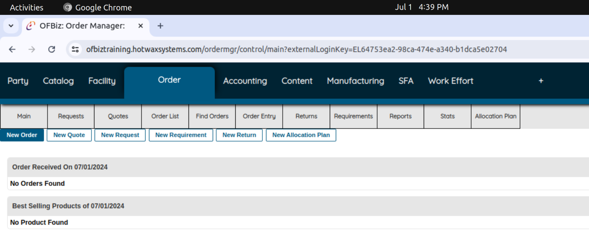

### 2. Click New order and choose the product store & fill in the details.

### 3. Choose the product to purchase & its quantity.

### 4. Verify Product & choose it to proceed further.

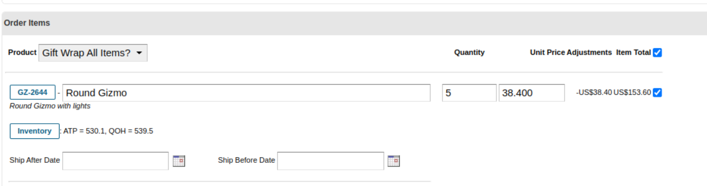

### 5. Create Shipment by first Add Shipping Address & click continue.

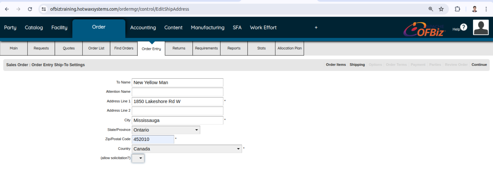

### 6. Create a custom ship group, else choose the default.

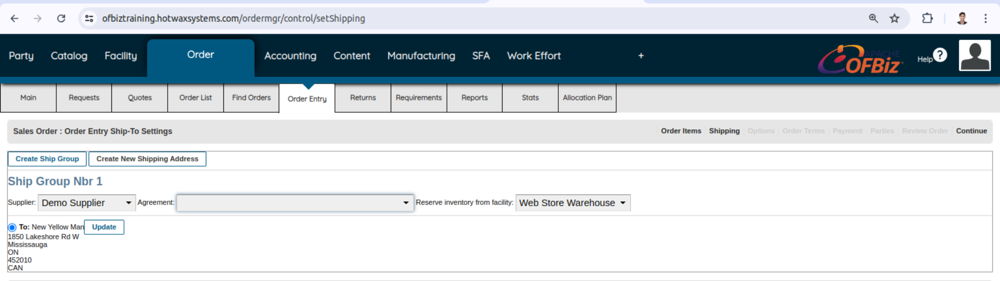

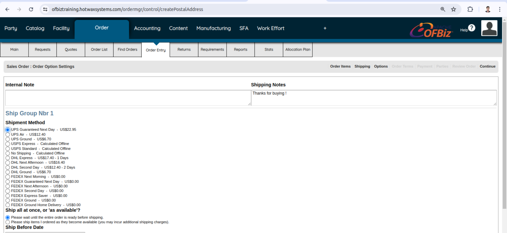

### 7. Choose a Payment Method.

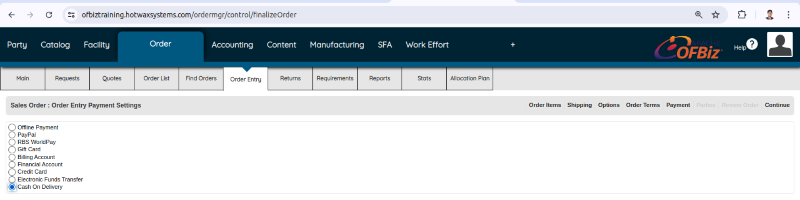

### 8. Associate party type to order else choose the third option.

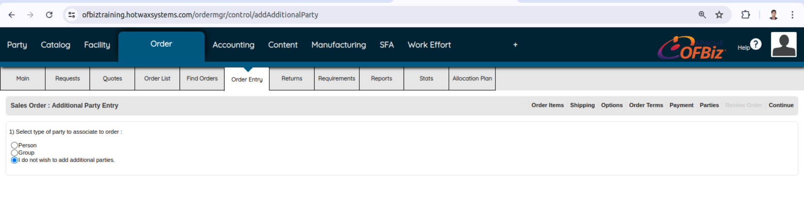

### 9. Check the order in the order list

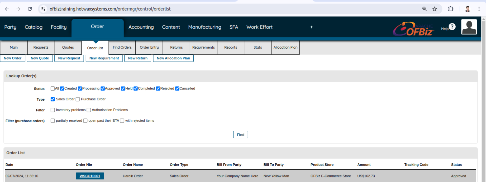

### 10. Verify the details in Order Confirmation.

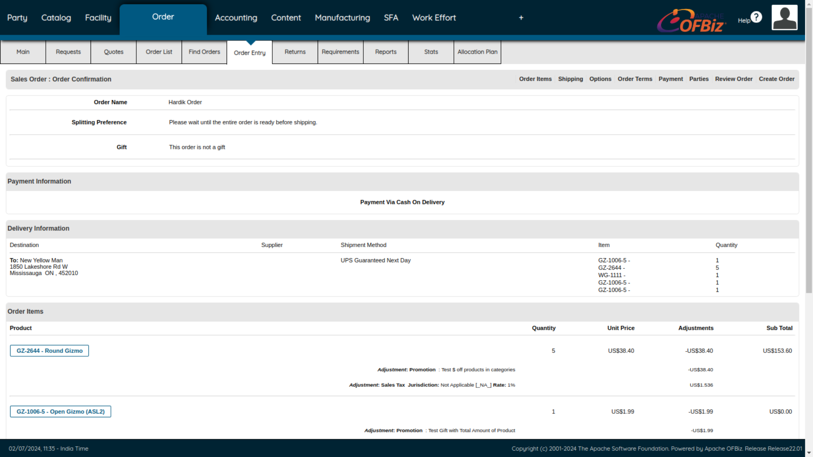

### 11. Check the shipping Information & Pack Shipment for Ship Group

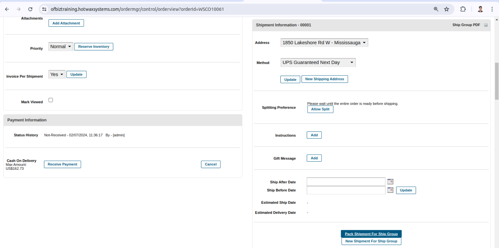

### 12. Check the item & pack them also fill the packet Weight (lb)

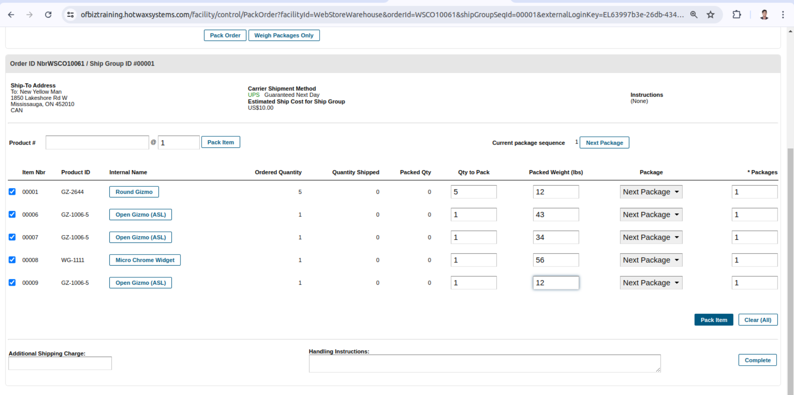

### 13. Click Complete to Complete the order as soon as it’s shipped.

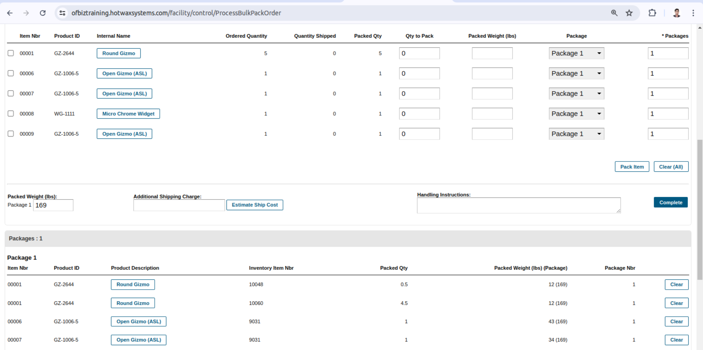

### 14. Check for this message to ensure the order is marked as shipped correctly.

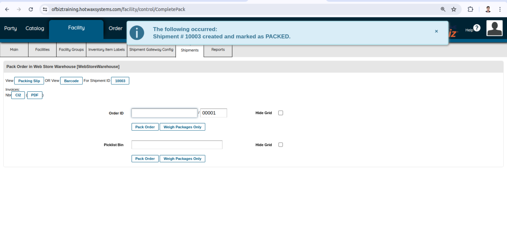

### 15. Click on Shipment to edit & change its status to Ship(Pack).

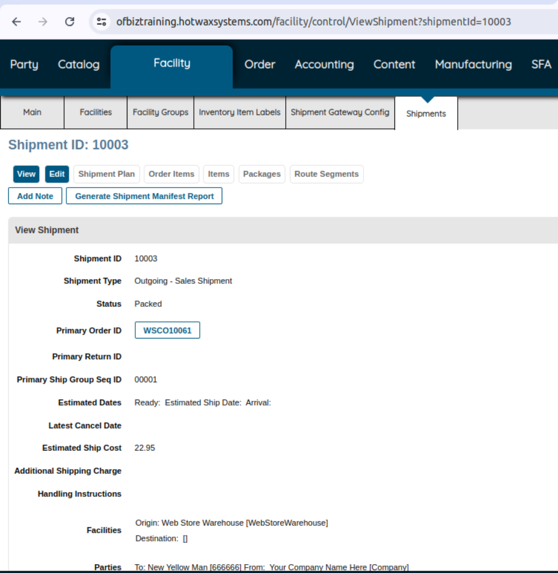

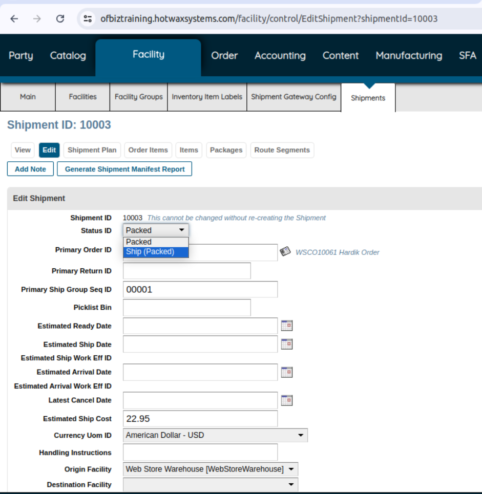

### 16. Change its status again to Delivered(Shipped) once it’s delivered to the customer.

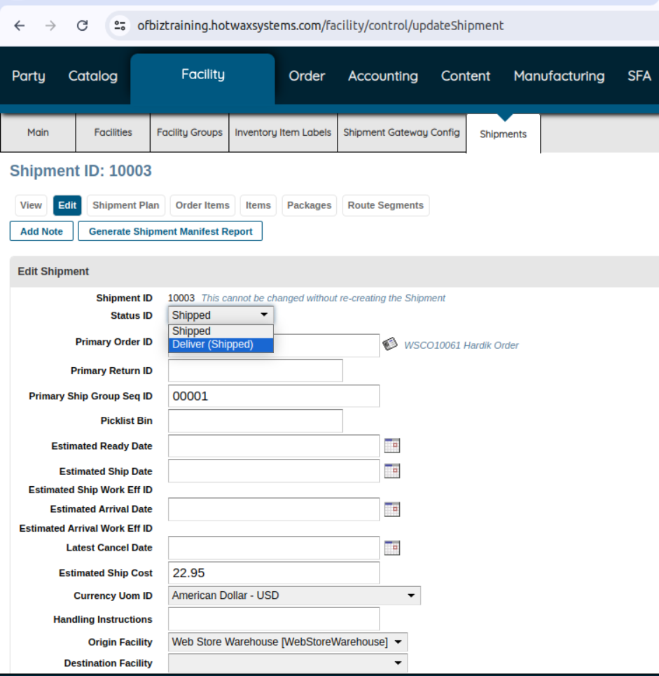
