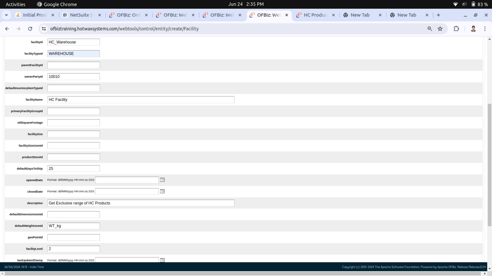
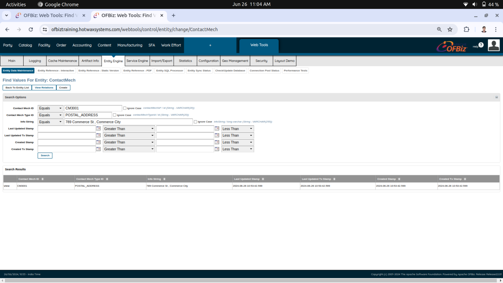
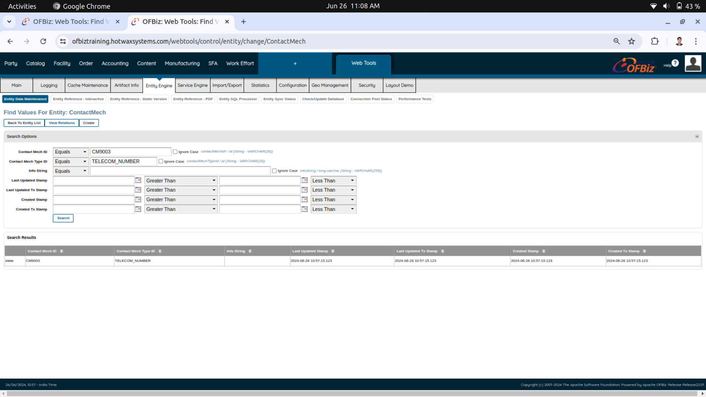
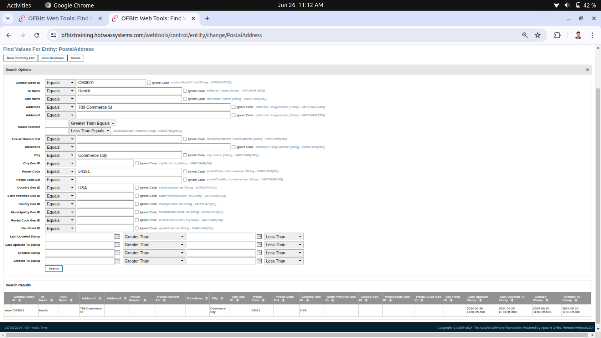
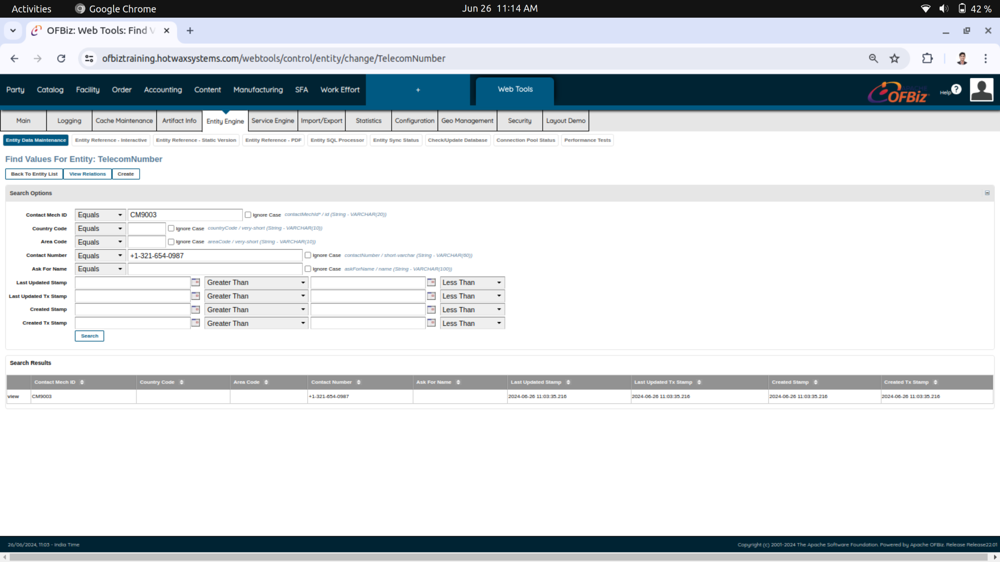

# Facility Assignment

```json
{
  "Facility": {
    "facilityId": "HC_Warehouse",
    "facilityTypeId": "WAREHOUSE",
    "ownerPartyId": "10010"
  },
  "FacilityContactMech": [
    {
      "facilityId": "HC_Warehouse",
      "contactMechId": "CM3001",
      "fromDate": "2024-03-01"
    },
    {
      "facilityId": "HC_Warehouse",
      "contactMechId": "CM9003",
      "fromDate": "2024-03-01"
    }
  ],
  "ContactMech": [
    {
      "contactMechId": "CM3001",
      "contactMechTypeId": "POSTAL_ADDRESS"
    },
    {
      "contactMechId": "CM9003",
      "contactMechTypeId": "TELECOM_NUMBER"
    }
  ],
  "PostalAddress": {
    "contactMechId": "CM3001",
    "address1": "789 Commerce St",
    "city": "Commerce City",
    "postalCode": "54321",
    "countryGeoId": "USA"
  },
  "TelecomNumber": {
    "contactMechId": "CM9003",
    "contactNumber": "+1-321-654-0987"
  }
}
```

### 1. Creating Facility




### 2. Creating ContactMech Postal Address [CM3001]



### 3. Creating ContactMech for telecom number [CM9003]



### 4. Creating Postal Address



### 5. Creating TelecomNumber

